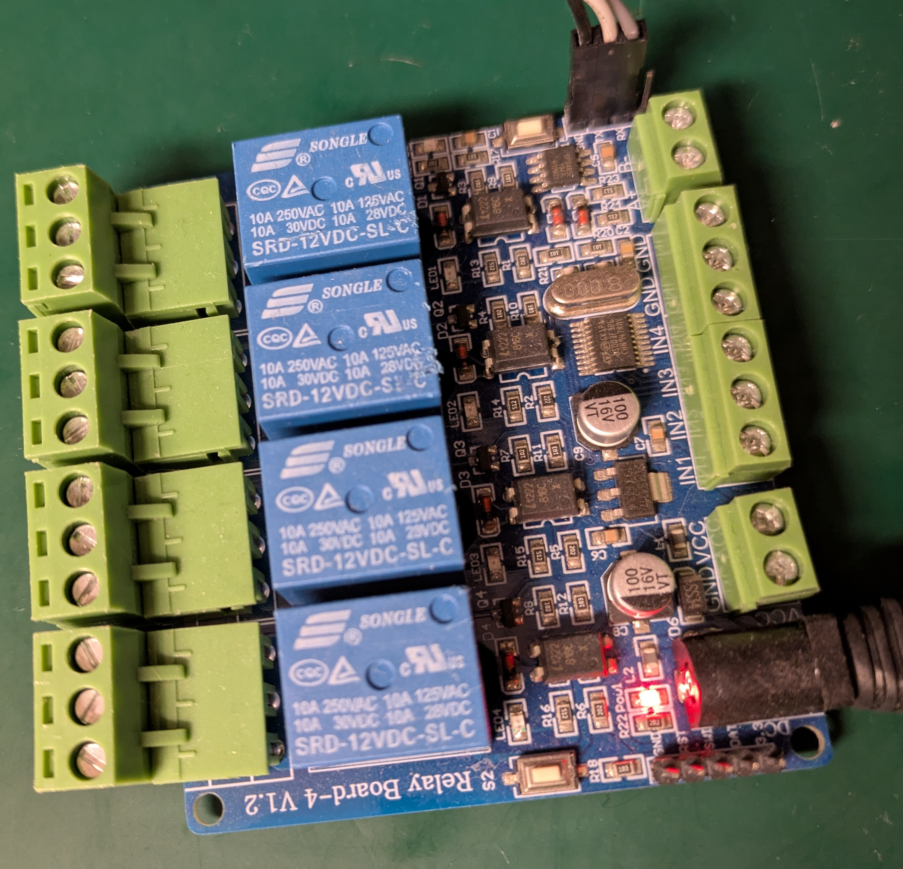

Alternative firmware for stm8s based 4x relay module
====================================================

Overview
--------

This repository contains alternative firmware for popular relay boards
available from China.



Flashing
--------

```console
stm8flash -c stlinkv2 -p stm8s003f3p6 -w build/out/relay_ctl.ihx
```

Building
--------

[sdcc](https://sdcc.sourceforge.net/) version 4.2.0 or higher is required for building.
 
```console
# Debian Linux and its derivatives
sudo apt-get install sdcc
```

```console
make -f relay_ctl.Makefile
```

all build artifacts are located in ***build*** directory, which can be changed
by defining ***BUILD_DIR*** environment variable.

```console
BUILD_DIR=foo make -f relay_ctl.Makefile
```

GitHub CI is configured for the project
[status](https://github.com/wdl83/stm8s_relay_board_4x/actions)

Tools & Trouble Log
-------------------

[Modbus tools](https://github.com/wdl83/modbus_tools), can be used to send/receive
requests from the device.
[json](json) directory contains example requests.
Current implementation supports configurable size trouble log which can be fetch
from the device

```console
master_cli -d /dev/ttyUSB0 -i json/tlog_fetch.json -o tlog.json
```

result can be be decoded with
[tlog_dump](https://github.com/wdl83/modbus_tools/blob/master/tlog_dump.Makefile)

```console
cat tlog.json | tlog_dump
```

[master_cli](https://github.com/wdl83/modbus_tools/blob/master/master_cli.Makefile)
supports reading from stdin and writing to stdout, so complete operation can be done at once

```console
cat json/tlog_fetch.json | master_cli -d /dev/ttyUSB0 -i - | tlog_dump
```
